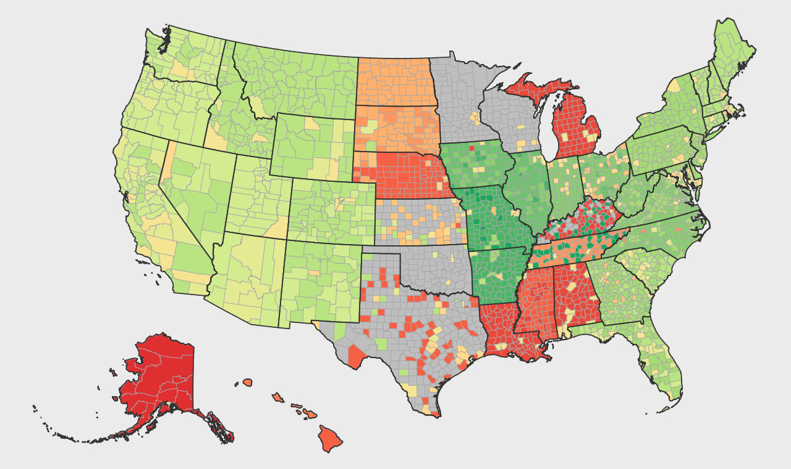
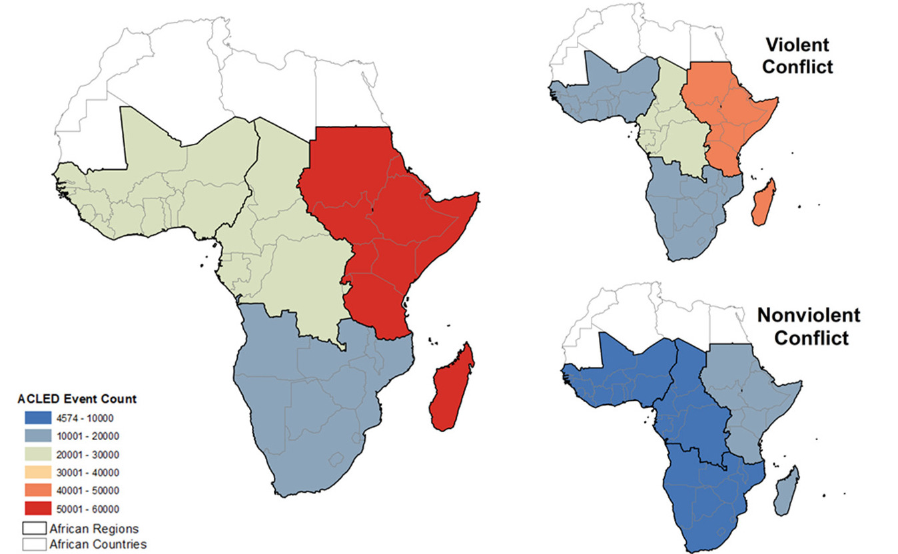

## Current Projects
 
 **Linkages and interactions between urban food security and rural agricultural systems** 
 

This research investigates linkages and interactions between urban food security and rural agricultural production. We focus on evaluating the impact of environmental variability on rural agricultural production and how this affects urban food security. My dissertation research investigates how the dynamics of urban population growth across secondary cities in southern Africa affect rural-urban linkages and ultimately household food security. We use household survey datasets in combination with large scale socio-environmental data. 

 
{width=300px; height=300px}
 
Urban agriculture in Choma, Zambia

 
 
 **Roots for Resilience Data Science Assistantship** 
 

This program trains graduate students in the use of open science and computational infrastructure, such as CyVerse, to apply data science tools to their dissertation’s research and discovery, as well as increase their department’s data science capacity. This assistantship includes discussions, training, exploration and experimentation with tools supporting personal research activities within my research group and across the department. [More information][r4r]
 
 

 **Research on COVID-19 Interventions and Impacts (ReCON)** 
 

The COVID-19 pandemic has had a wide range of societal impacts. Along with an interdisciplinary team of researchers, I am working on understanding how governments have responded to mitigate the spread of COVID-19 through policies that seek to modify behavior and limit person-to-person transmission. We are also investigating how household food security has changes as a result of economic and other hardship caused by the pandemic. [More information][recon]

 
{width=300px; height=300px}
 
Non-Pharmaceutical Intervention Coding Progression (Nov 2021)

 
 
 **A socio-environmental synthesis of the linkages between water scarcity induced conflict and land use/land cover change in Africa to enhance multi-scalar decision making** 
 

I am a member of a team of researchers investigating the relationships between climate change and conflict across Africa, funded through the Socio-Environmental Synthesis Center. This interdisciplinary team examine where, when and how conflicts arise over water. We analyze conflict events, environmental change, society and institutions to investigate the spate-temporal dynamics of water scarcity and how they are linked with conflict. [More information][sesync] 

 
{width=300px; height=300px}
 
Distribution of Conflict Events by Sub-Saharan African Region (1997-2018)

 

## Past Projects
 
 **Impacts of Agricultural Decision Making and Adaptive Management on Food Security** 
 

I was a member of this interdisciplinary project that used high-frequency data from environmental sensors and farmers to understand how farmers respond to different environmental shocks, and how those shocks shape their perceptions of climate variability. This involved coupling data from SMS surveys, household surveys and environmental data in Kenya and Zambia. We also worked on monitoring the outbreak of Fall Armyworm in Zambia throughout the 2018-2019 agricultural season. [More information][faw]

 
{width=300px; height=300px}
 
Maize fields, Nanyuki, Kenya (Photo: Zack Guido)

 
 
 **Carson Scholar Science Communication Program** 
 

I was a Carson scholar in 2019 and received comprehensive training on the art of science communication. I worked with faculty mentors to develop my skills to explain the value of my research and improve my skills in presenting science to a variety of audiences. [More information][carson]

[recon]:https://covidinterventions.arizona.edu
[sesync]:https://www.sesync.org/project/propose-a-pursuit/a-socio-environmental-synthesis-of-the-linkages-between-water-scarcity
[r4r]:https://datascience.arizona.edu/roots-resilience-0
[faw]:http://www.faw.environment.arizona.edu/about_us.html
[carson]:https://carson.arizona.edu

